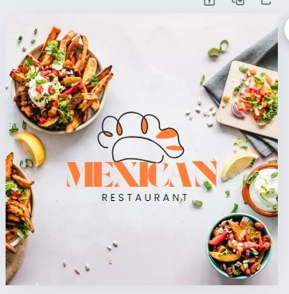
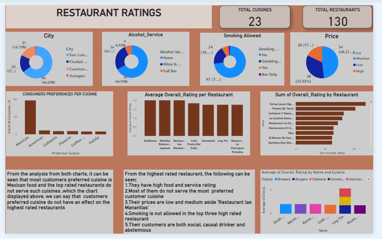
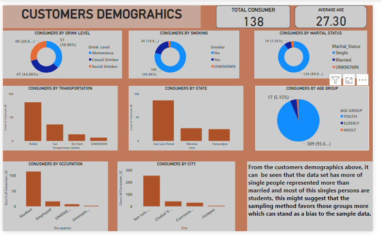
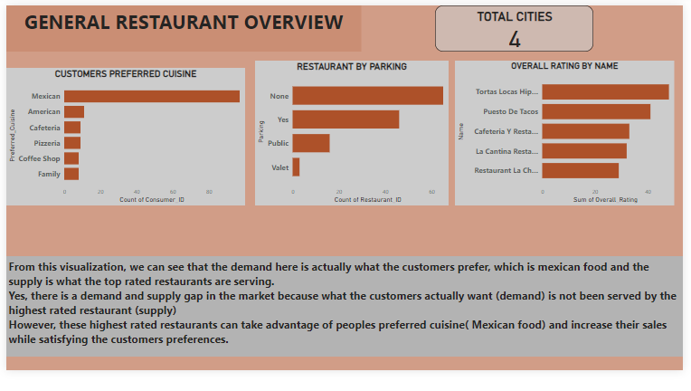

# MEXICAN-RESTAURANTS

# INTRODUCTION

This dataset named **the restaurant rating dataset** includes details about Mexican restaurants. In this city, a customer survey was conducted in 2012 to gather data about each restaurant, their menus, client demographics, and customer preferences.

**_Disclaimer:_** _All datasets and reports do not represent any company, institution or country, but just a dummy dataset to demonstrate capabilities of Power BI._

# PROBLEM STATEMENT
1.What can you learn from the highest rated restaurants? Do consumer preferences have an effect on ratings?

2. What are the consumer demographics? Does this indicate a bias in the data sample? 

3. Are there any demand & supply gaps that you can exploit in the market? 

4. If you were to invest in a restaurant, which characteristics would you be looking for?

# SKILLS/ CONCEPTS DEMOSTRATED
 The following power bi features
- Page navigation 
- Filtering
- New measure
- Power query editor 
- Custom visuals
- Data importation
- Data modelling

  # MODELLING
There are;
- 4 dimension table 
- 1 fact table.
  
# VISUALIZATION
- Restaurant rating
- Customer demographics
- General restaurant

  #### [You can interact with the report here](file:///C:/Users/USER/AppData/Local/Temp/Power%20BI%20Desktop/print-job-acaa7b90-79a7-41c3-9ae9-f95df2527430/CAPSTONE%20P2.pdf)

  
 # RESTAURANT RATINGS
 
 
# Features
There are;
- Three donut charts
- A pie chat
- Three clustered column charts
- A clustered column
- Two cards viuals.

# ANALYSIS
- There are a total of 130 restaurants with 12 cuisines.
- Each visualization explains the restaurants in mexico with either the city they are in, smoking services,price, alcohol services. Visualization of the cuisines served by these restaurants were also displayed.
- Preferred customers cuisines was equally represented in  the visuals.
- From the dashboard, we can gather that mexican cuisines were preferred most.
- Tortas locas hipocampo had the most orders 
- There were 3 best rated restaurants , Emilianos, Michiko Restaurant Japones and Restaurant Las Mananitas 
- Some of their cuisine includes; mexican, american, brewery,bugers, cafeterian etc.

# CUSTOMERS DEMOGRAPHICS

# Features 
There are;
- Three donut charts,
- A pie chart,
- Two cards visual
- Four clustered column chart.

# ANALYSIS

- There are 138 customers with  an average age of 27.
- Customers were accessed based on the following;transportation, state, age group and marital status, city, occupation etc.
-  we were able to visually represent informations about the customers with appealing visuals.
 # GENERAL RESTURANT 
 
# Features 
- it contains a card visual
- Three clustered column charts

# ANALYSIS
Every other information about the restaurant was displayed.
# CONCLUSION AND RECOMMENDATION 
From the highest rated restaurant, the following can be seen;
- They have high food and service rating
- Most of them do not serve the most  preferred customer cuisine
- Their prices are low and medium aside 'Restaurant las Manantias'
- Smoking is not allowed in the top three high rated restaurant
- Their customers are both social, causal drinker and abstemious 
   Also, customers preferences do not have an effect on the ratings of the restaurants.
        
2.**From the customers demographics**, it can be seen that the data set has more of single people represented than married people.Most of them  are not smokers,they use a public means of transportation, they stay in *san luis potosi* which is also where most restaurants are situated.  From the marital status, city and occupation we can say that there might be cases of bias as one group is mostly represented in the data set than another

3. **From the third dashboard**, there is a demand and supply gap as what the customers prefer the most ( mexican food) is not totally served by the highest rated restaurants. 
If the highest rated restaurants, takes charge of the preferences of their customers with their already high food and service rating would make more sales and customers satisfied.

 4.  **Some characteristics** that i would be looking out for if i were to invest in a restaurant would include  restaurants that;
- Have quality service and food rating
- Serve most of the customers preferences 
- Have a medium or low price
- Is loacted where most costumes reside
  
# RECOMMENDATIONS
 - Most of the restaurants should serve at a reduced price or have a more affordable pricing.
 - Restaurants should conduct follow-up surveys to understand trends over time.
 - Align your menu and services with the preferences identified in the customer survey
- Identify aspects of the restaurant experience (e.g., service, ambiance) that are receiving low ratings and implement improvements.
- Target Marketing: Use customer segmentation data to tailor marketing campaigns to different customer groups

